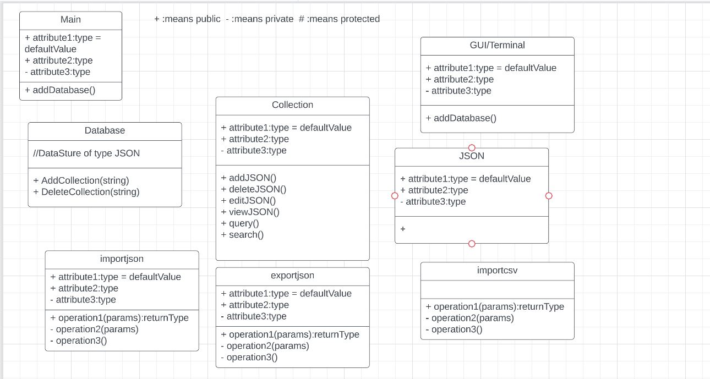

# Document Data Store

General document database for information/document storage running in a console.

## Team Members
- Farnaz Mozhgani (software architect)
- Fnu Azma (user/programming interface engineer)
- Muneeb Ghori (data structure engineer)
- Adeel Hussain (algorithm and performance specialist / data structure engineer)
- Uzair Memon (user/programming interface engineer)
- Harsh Patel (Development Lead / Testing Lead)

## Technologies
- **Interface**: terminal/shell console
- **Programming languages**: C++
- **Libraries**: RapidJson, GTest

## Features (tentative)
- Feature 1: Filtering data
- Feature 2: querying documents
- Feature 3: search for unique identifiers 
- Feature 4: CRUD operations

