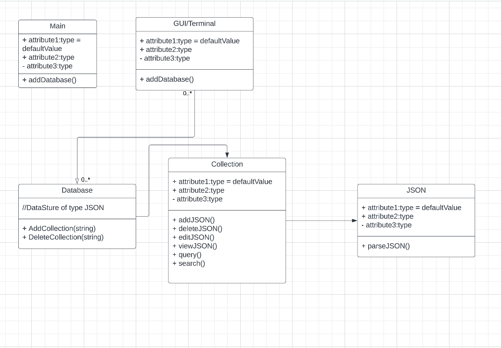
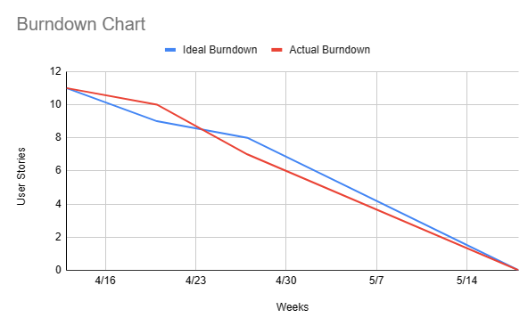

# FriendlyCDB

## Project Description
General document database for information/document storage running in a console.

## Team Members
- [Farnaz Mozhgani](https://github.com/farnazi2000) (software architect)
- Fnu Azma (user/programming interface engineer)
- [Muneeb Ghori](https://github.com/muneebghori) (data structure engineer)
- [Adeel Hussain](https://github.com/hussain-adeel) (algorithm and performance specialist / data structure engineer)
- Uzair Memon (user/programming interface engineer)
- [Harsh Patel](https://github.com/hp6164) (Development Lead / Testing Lead)

## Technologies
- **Interface**: terminal/shell console *tentative (up for change)
- **Programming languages**: C++ (Back-End), (C++ (Front-End)   *tentative (up for change))
- **Libraries**: [RapidJson](https://github.com/Tencent/rapidjson), [GoogleTest](https://github.com/google/googletest) , [gnuplot](https://github.com/gnuplot/gnuplot)

## Features (tentative)
- Feature 1: CRUD operations
- Feature 2: Filtering data
- Feature 3: querying documents
- Feature 4: search for unique identifiers 
- Feature 5: csv to json

- **User friendly interface Documentation:**

## Class Diagram
[FriendlyCDB_UML](https://lucid.app/documents/embedded/2fd26883-22f0-4d6a-bd90-33ecd24ce9b5#)

## Burndown Chart Updated as of 4/27/2023

